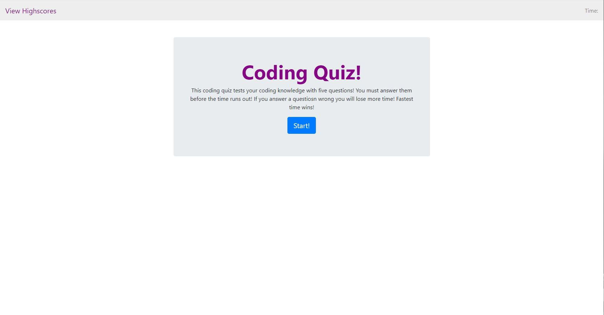

# Coding-Quiz
Here is a Coding quiz design and built for the UNC coding bootcamp.

It includes two HTML files and two Javascript files to create a dynamic application. This application asks the user five questions and displays a highscore page at the end fo the app based on the users score. This css is dynamically changed with Javascript and the score and time intervals are stored in the browser memory of the user.

Here is a photo of the intro page:

